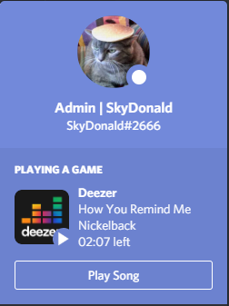

# DeezerRPC
Deezer integrated with the Discord Rich Presence.

## Instructions
- Download the [latest release](https://github.com/SkyDonald/DeezerRPC/releases)
- Run the app and listen what you want!
### If your are on Linux or MacOS download the repo and type `npm run dist-linux` or `npm run dist-mac` then open DeezerRPC/dist and open the main file.

## Any problem?
You can contact us for support on our [chat server](https://discord.gg/AUfTUJA)

# Give me your opinion

## Exemple

## Note
This project is not supported and created by Deezer.

This application opens the web version of the Deezer application and performs background operations to collect data from the current song. It does not use the Deezer API, everything is collected from the DOM itself.
